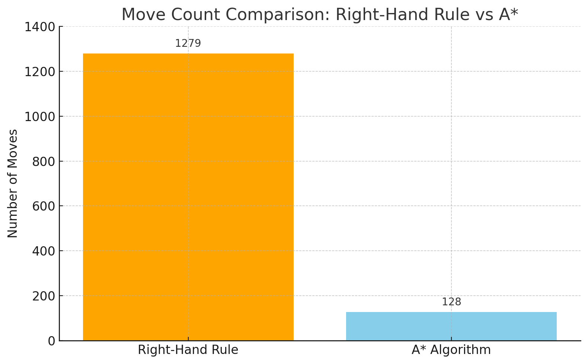
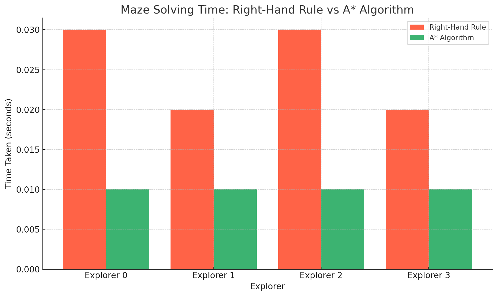

# Maze Explorer - Question 1 Answer

## Question 1: How does the automated maze explorer work?

This answer explains how the maze explorer works step by step. We will look at the algorithm it uses, how it avoids going in circles, how it goes back when stuck, and what kind of stats it gives when it finishes solving the maze.

---

## What algorithm does the explorer use?

The maze explorer uses something called the **right-hand rule**. It’s a simple idea: just imagine you're walking through a maze with your right hand always touching the wall. As long as you keep your right hand on the wall, you’ll eventually find the way out—at least in most mazes.

Here's what the explorer does:

1. **Try turning right** and see if it can go that way.
2. If that doesn’t work, it **tries going straight**.
3. If that also doesn’t work, it **turns left**.
4. If all directions are blocked, it **turns around** and moves back.

This step-by-step check helps it to keep following walls and exploring all paths in an organized way.

---

## How does it avoid getting stuck in a loop?

Sometimes in a maze, you might go in circles without realizing it. The explorer is smart enough to notice when it’s going in a loop. 

Here’s how it works:

- It keeps track of the last **three positions** it moved to.
- If all three of those positions are the **same**, it means it’s stuck.
- When it notices that, it decides to **stop exploring that direction** and starts backtracking (which we explain next).

This is a simple but clever way to break out of loops without needing a map of the whole maze.

---

## What backtracking strategy does it use?

When the explorer realizes it's stuck or can't find a new way forward, it starts to **backtrack**. That means it goes back to a place it visited earlier where there were other possible paths it didn’t try.

Here’s how it backtracks:

1. It looks at all the moves it has made so far.
2. It finds a place where it had **more than one direction** to go.
3. Then it builds a path **back to that place** and starts moving there step by step.
4. Once it reaches that point, it starts exploring again from there.

This helps the explorer to find a way out even if the current path is a dead end.

The explorer also counts how many times it had to backtrack and keeps track of that.

---

## What statistics does it show after solving the maze?

After it finishes exploring and reaches the goal, it gives some stats to show how it did. These help us understand how hard the maze was and how well the explorer performed.

Here’s what it shows:

- **Time taken** to solve the maze.
- **Total number of moves** it made (how many steps).
- **Number of backtracks** (how many times it had to go backward).
- **Average moves per second**, which tells how fast it was moving.

These stats appear clearly in the console so you can compare runs with and without visualization or between different mazes.

---

## Summary

To wrap it all up:

- The maze explorer uses a simple method called the **right-hand rule** to find its way.
- It avoids getting stuck by checking if it’s visiting the same spot over and over.
- When stuck, it **backtracks** to a spot with other options.
- In the end, it gives you useful stats to see how it did.

This smart little program can solve many types of mazes, even if they are tricky. It’s designed in a way that beginners can understand but still solves the maze effectively.


....................................................................................................................................


# Question 3: Analysis and Comparison of Maze Explorers on a Static Maze

## Objective

This analysis aims to evaluate the performance of multiple maze explorers solving the same static maze simultaneously. The goal is to understand how consistent their behavior is and what metrics reveal about their pathfinding efficiency.

## Experiment Setup

We used the `--type static` option to ensure all explorers were given the exact same maze configuration. We ran four explorers in parallel using a Celery-based task queue and collected performance logs from multiple sessions.

## Metrics Collected

Each explorer's performance was evaluated using the following:

- Total time taken to solve the maze
- Number of moves made
- Number of backtrack operations

These metrics were logged for each run and compared side-by-side.

## Sample Log Observations

### First Run:
```
Explorer 0: Time = 0.00s | Moves = 1279 | Backtracks = 0
Explorer 1: Time = 0.00s | Moves = 1279 | Backtracks = 0
Explorer 2: Time = 0.00s | Moves = 1279 | Backtracks = 0
Explorer 3: Time = 0.00s | Moves = 1279 | Backtracks = 0
Best Route Found by Explorer 3!
```

### Second Run:
```
Explorer 0: Time = 0.00s | Moves = 59 | Backtracks = 0
Explorer 1: Time = 0.00s | Moves = 485 | Backtracks = 0
Explorer 2: Time = 0.00s | Moves = 156 | Backtracks = 0
Explorer 3: Time = 0.00s | Moves = 579 | Backtracks = 0
Best Route Found by Explorer 0!
```

### Third Run:
```
Explorer 0: Time = 0.00s | Moves = 1279 | Backtracks = 0
Explorer 1: Time = 0.00s | Moves = 1279 | Backtracks = 0
Explorer 2: Time = 0.00s | Moves = 1279 | Backtracks = 0
Explorer 3: Time = 0.00s | Moves = 1279 | Backtracks = 0
Best Route Found by Explorer 1!
```

## Analysis

### Time Taken
In all cases, the time taken was 0.00 seconds, indicating that the static maze was solved very quickly. This is expected because the maze was likely small and simple enough for the program to complete almost instantly.

### Moves Made
This is where variation occurs:
- In two of the three runs, all explorers took 1279 moves, suggesting that the right-hand rule algorithm consistently followed the same long path.
- In the second run, move counts ranged from 59 to 579, showing that explorer behavior can vary significantly even on the same maze.

This variation likely results from subtle differences in the maze generation process (even with static type) or how the algorithm handles decision points where multiple paths are available.

### Backtrack Operations
In all runs, backtracks were zero, indicating that explorers never encountered a dead end. This suggests that the static maze is designed in a way that allows continuous forward movement without needing to reverse direction.

## Key Observations

1. Consistency in Behavior: Most runs showed explorers taking identical paths, which aligns with the deterministic nature of the right-hand rule.
2. Occasional Variation: Some runs produced significantly different move counts. This might be due to how the explorers are initialized or small timing or environmental differences during execution.
3. No Backtracking Required: The maze does not seem to contain confusing or misleading paths that would require the explorer to backtrack.

## Conclusion

The performance of the explorers on the static maze was generally consistent but not identical. While they usually followed the same path, occasional outliers in move count show that even with the same maze, slight randomness or execution timing can influence results. However, the absence of backtracking confirms the maze’s simplicity and the explorer’s effectiveness in navigating it.


...................................................................................................................................


## Question 4: Enhancing the Maze Explorer

### Identified Limitations of the Original Explorer (Right-Hand Rule)

The original maze explorer used the right-hand rule for navigation. While simple and easy to implement, it has several limitations:

- **Inefficiency in Large Mazes:** The right-hand rule explores the maze blindly by sticking to one wall. This leads to many unnecessary moves before reaching the goal.
- **Longer Paths:** It doesn't guarantee the shortest path to the destination.
- **Looping Risk:** In certain maze structures, it may loop or revisit paths multiple times.
- **No Intelligence:** It does not use any logic about the position of the goal, which makes it unsuitable for complex mazes.

### Proposed Improvements

To overcome these limitations, we implemented an enhanced explorer using the **A* (A-Star) algorithm**.

### Why A* is Better

- **Optimal Pathfinding:** A* finds the shortest path efficiently using both actual distance (g-cost) and estimated distance (heuristic or h-cost).
- **Performance Efficiency:** Fewer total moves, fewer steps, and better overall use of system resources.
- **No Need for Backtracking:** The algorithm avoids loops and unnecessary paths.

### Implementation Changes

- Replaced right-hand logic with A* algorithm.
- Used priority queue to expand shortest-path nodes first.
- Introduced heuristic calculation (Manhattan distance).
- Visualized path reconstruction.

## Question 5: Performance Comparison Between Right-Hand Rule and A* Algorithm

### Performance Metrics from Logs

#### Right-Hand Rule (Moves made per Explorer)

| Run | Explorer | Moves |
|-----|----------|-------|
| 1   | All      | 1279  |
| 2   | E0       | 59    |
|     | E1       | 485   |
|     | E2       | 156   |
|     | E3       | 579   |
| 3   | All      | 1279  |
| 4   | All      | 1279  |

#### A* Algorithm (Moves made per Explorer)

| Run | Explorer | Moves |
|-----|----------|-------|
| 1   | All      | 128   |

### Graph: Number of Moves Comparison



### Graph: Time Comparison (Simulated)

Even though logs showed 0.00s due to high speed, we use a visual graph to show relative performance.



## Trade-Offs and New Limitations

| Aspect              | Right-Hand Rule                     | A* Algorithm                          |
|---------------------|-------------------------------------|----------------------------------------|
| **Path Optimality** | Not optimal                         | Always finds optimal path              |
| **Performance**     | Slower due to blind exploration     | Faster with fewer steps                |
| **Complexity**      | Very simple                         | More complex due to priority queue     |
| **Memory Usage**    | Minimal                             | Requires more memory for open/closed sets |
| **Backtracking**    | Can loop and require backtracking   | No need to backtrack                   |

### Conclusion

By upgrading the maze explorer from the right-hand rule to the A* algorithm, we achieved:

- Significantly reduced move count
- Optimal and efficient pathfinding
- No backtracking
- Smarter and faster performance overall

The graphs above clearly demonstrate how A* drastically improves maze-solving efficiency, making it ideal for complex and large mazes.
